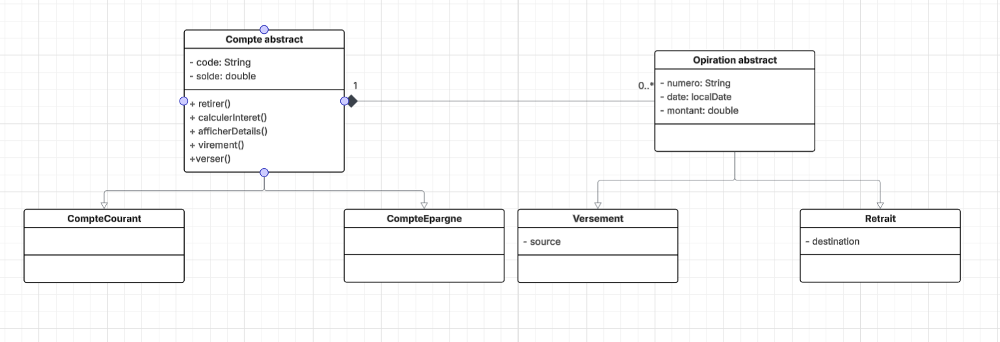

# Système de Gestion de Comptes Bancaires

> Application console (Java 8) permettant de gérer des comptes bancaires (CompteCourant, CompteEpargne) et leurs opérations (Versement, Retrait, Virement).

---

## 📌 Description

Ce projet est une application console développée en **Java 8** qui simule la gestion bancaire basique : création de comptes, versements, retraits, virements, consultation des soldes et historique des opérations. L'application respecte une **architecture en couches** (présentation, métier, utilitaire) et met l'accent sur la séparation des responsabilités et la propreté du code.

> **Remarque :** Ce README couvre uniquement les exigences principales du cahier des charges — les *bonus* (persistences MySQL, Streams, lambdas avancées) ne sont pas implémentés ici.

---

## ✅ Fonctionnalités principales

* Créer un compte (CompteCourant / CompteEpargne)
* Effectuer un **versement** dans un compte
* Effectuer un **retrait** depuis un compte (règles propres à chaque type)
* Effectuer un **virement** entre deux comptes (réutilise versement + retrait)
* Consulter le **solde** d'un compte
* Consulter la **liste des opérations** d'un compte (avec date et UUID)
* Validations d'entrées : montants positifs, format du code de compte (`CPT-XXXXX`), etc.

---

## 🧰 Technologies

* Java 8 (obligatoire)
* Collections Java : `ArrayList`, `HashMap`
* Java Time API (`java.time` : `LocalDateTime`) pour les dates d'opérations
* IDE recommandé : **Eclipse**
* Gestion de versions : **Git** (dépôt GitHub)
* (Optionnel) JIRA pour la gestion des tâches

---

## 📂 Structure du projet (suggestion)

```
gestion-de-comptes-bancaires-/
├─ src/
│  ├─ presentation/      # UI / menu console
│  ├─ service/           # logique métier (AccountService)
│  ├─ métier/             # classes : Compte, CompteCourant, CompteEpargne, Operation, Versement, Retrait       
│  └─ utilitaires/        # utilitaires (ValidationChoix, ValidationUtils)
├─ bin/
├─ .setting/
├─ README.md
├─ GestionComptes.jar
├─ .project
└─ .classpath
```

---

## ⚙️ Prérequis

* JDK 8 installé et configuré (`java -version` doit retourner une version 1.8.x)
* Eclipse recommandé mais pas obligatoire
* Git installé pour versionner le projet

---

## 🛠️ Compilation et création du JAR (Windows - Eclipse Workspace)

1. Compiler les sources :

```bash
# depuis la racine du projet
javac -d bin src\Main.java src\metier\*.java src\services\*.java src\presentation\*.java
```

2. Créer le fichier manifest pour indiquer la classe principale :

```
Manifest-Version: 1.0  
Main-Class: Main  
```

3. Créer le JAR exécutable (classe principale = Main) :

```bash
jar cfe GestionComptes.jar Main -C bin .
```

4. Exécuter l'application :

```bash
java -jar GestionComptes.jar

```

> **Astuce** : si vous n'utilisez pas `find`, vous pouvez compiler en listant les fichiers .java ou configurer un build via un script Ant/Maven (non requis ici).

---

## 🖥️ Utilisation (menu console)

Le menu principal propose des options claires, par exemple :

1. Créer un compte
2. Lister les comptes
3. Consulter le solde d'un compte
4. Effectuer un versement
5. Effectuer un retrait
6. Effectuer un virement
7. Consulter les opérations d'un compte
8. Quitter

Chaque saisie utilisateur est validée (format du code, montant > 0, compte existant, règles de retrait selon le type de compte).

---

## 🧩 Modèles de classes (résumé)

* `Compte` (abstrait)

  * `String code` (format `CPT-\d{5}`)
  * `double solde`
  * `List<Operation> listeOperations`
  * méthodes abstraites : `boolean retirer(double montant)`, `double calculerInteret()`, `void afficherDetails()`

* `CompteCourant` extends `Compte`

  * `double decouvert` (plafond autorisé en négatif)
  * retrait autorisé si `solde - montant >= -decouvert`
  * `calculerInteret()` retourne 0

* `CompteEpargne` extends `Compte`

  * `double tauxInteret`
  * retrait autorisé seulement si `solde >= montant`
  * `calculerInteret()` calcule `solde * tauxInteret`

* `Operation` (abstrait)

  * `UUID numero`
  * `LocalDateTime date`
  * `double montant`

* `Versement` extends `Operation`

  * `String source`

* `Retrait` extends `Operation`

  * `String destination`

---

## ✅ Validations et exceptions

* Vérifier le format du code : `CPT-12345` (regex : `^CPT-\d{5}$`)
* Montants doivent être strictement positifs
* Gestion des erreurs utilisateurs via `try / catch` et messages clairs
* Exceptions métier personnalisées (ex : `CompteNotFoundException`, `SoldeInsuffisantException`)

---

## 🧭 Bonnes pratiques & architecture

* Respecter la séparation des couches (UI ↔ service ↔ repository)
* Eviter les *God classes* : chaque classe a une responsabilité claire
* Respecter l'encapsulation : champs privés, getters/setters quand nécessaire
* Appliquer SOLID (notamment Single Responsibility et Dependency Inversion via interfaces pour les services/repositories)

---

## 📁 Git & workflow

* Commits fréquents et atomiques

* Messages de commit en **français** (exemples) :

  * `feat: ajout création compte courant et validations`
  * `fix: correction règle retrait compte épargne`
  * `chore: ajout script de build javac/jar`

* Branching simple : `main` (stable), `dev` (en cours), feature branches `feature/creer-compte`

---

## 🧾 Livrables attendus

* Dépôt GitHub avec le code source complet
* Fichier `GestionComptes.jar` exécutable
* `README.md` (ce document)
* Diagramme de classes (image) — voir la section **Diagramme de classes** ci-dessous

---

## 📷 Diagramme de classes





---

## 📌 Critères d'évaluation (à respecter)

* Application fonctionnelle conforme aux exigences principales
* Utilisation de Java 8
* Architecture en couches respectée
* Code propre, lisible et commenté
* Commits Git réguliers et explicites
* README complet et clair
* Diagramme de classes fidèle à l'implémentation

---

